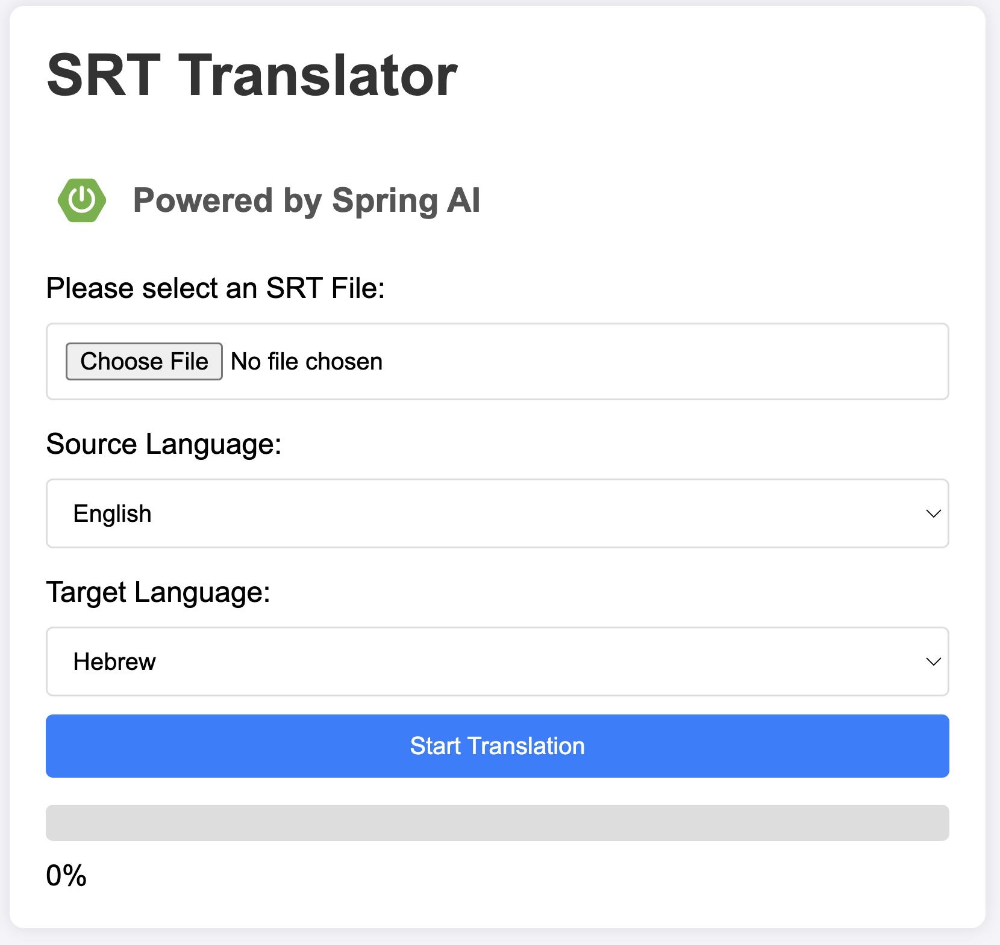

# SRT subtitle files translator - Powered by Spring AI

This is a simple Spring Boot application that takes an SRT file as an input, and translate it to the desired language.

The first implementation uses Azure OpenAI. It can easily be modified to use standard OpenAI thanks to the power of Spring AI.

I tested the code with local Llama3, Llama3.1 and Llama3.1:70b, all failed misrably at the task, so I decided to remove support for Llama at this stage.

In order to run the application, you should create a `creds.yaml` in `src/main/resources` based on the sample `creds-template.yaml`, with your Azure OpenAI endpoint and API Key.

Pull requests are welcomed!

Oded S.
